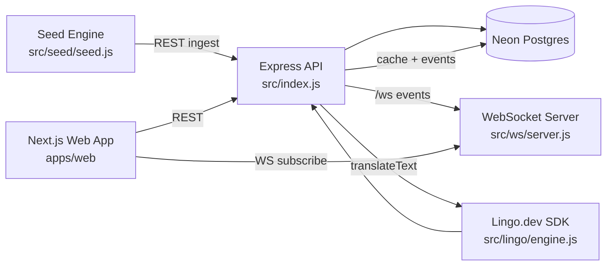

# LingoSports

**Realtime Sports Engine with multilingual live commentary.**


LingoSports is a hackathon-ready platform that streams live sports events, updates scores in realtime, and localizes commentary into 8 languages using `lingo.dev`.

It combines:
- A Node.js + Express backend for match/commentary APIs
- WebSocket fanout for realtime updates
- Neon Postgres + Drizzle ORM for persistence and translation cache
- A localized Next.js frontend for fan-facing live match experiences

## Why This Project

Most live sports apps are strong in realtime but weak in multilingual fan reach. LingoSports is designed to solve both:

- Realtime ingestion and fanout (`/ws`) for live match moments
- Translation-aware commentary APIs with caching and fallback
- Locale-aware frontend routes (`/[locale]`) for global audiences
- Repeatable simulation tooling so judges and reviewers can see activity immediately

## Core Features

- Live match APIs with score updates
- Live commentary ingest + retrieval with locale and quality controls
- WebSocket subscriptions by `matchId`, `locale`, and `quality`
- Precompute and on-demand translation pipeline with cache
- Translation metrics endpoint for coverage, latency, and cache-hit ratio
- Seed/reset workflow for deterministic hackathon demos
- Localization CI workflow with `lingo.dev`

## Architecture



### Runtime Data Flow

1. Commentary arrives via `POST /matches/:id/commentary`.
2. Backend resolves source locale, stores raw entry, and queues precompute translations.
3. WebSocket subscribers receive localized payloads.
4. If translation is not precomputed, clients get source fallback first and can receive `commentary_translation_ready` next.
5. Cached translations are reused on future reads and broadcasts.

## Tech Stack

| Layer | Stack |
|---|---|
| Backend | Node.js 22, Express 5, `ws`, `zod` |
| Database | Neon Postgres, `pg`, Drizzle ORM |
| Localization | `lingo.dev` SDK + CLI |
| Frontend | Next.js 16 (App Router), React 19 |
| Security | Arcjet (`shield`, bot detection, rate limiting) |
| CI | GitHub Actions (`.github/workflows/lingo.yml`) |

## Repository Layout

```text
.
├── apps/web/                  # Next.js localized fan UI
├── src/
│   ├── routes/                # REST API routes
│   ├── ws/                    # WebSocket subscription + fanout
│   ├── lingo/                 # Translation engine/cache/orchestration
│   ├── db/                    # Drizzle schema + DB client
│   ├── seed/                  # Match preload + stream simulator
│   └── frontend/              # Legacy static UI served by backend root
├── drizzle/                   # SQL migrations + snapshots
├── docs/                      # Integration notes
├── scripts/                   # Locale consistency checks
└── test/                      # Node test suite
```

## API Surface

### REST

| Method | Endpoint | Purpose |
|---|---|---|
| `GET` | `/healthz` | Health check |
| `GET` | `/matches?limit=100` | List matches |
| `POST` | `/matches` | Create match |
| `PATCH` | `/matches/:id/score` | Update live score |
| `GET` | `/matches/:id/commentary?locale=es&quality=standard&includeSource=1` | Localized commentary feed |
| `POST` | `/matches/:id/commentary` | Ingest commentary event |
| `GET` | `/lingo/stats?quality=standard` | Translation coverage/cache/latency stats |
| `POST` | `/seed/reset` | Reset commentary/translations and zero scores for demo replay |

### WebSocket (`/ws`)

Client subscribe payload:

```json
{ "type": "subscribe", "matchId": 1, "locale": "es", "quality": "fast" }
```

Server events:

- `welcome`
- `subscribed`
- `unsubscribed`
- `match_created`
- `match_updated`
- `commentary`
- `commentary_translation_ready`
- `data_reset`
- `error`

## Translation Engine Design

The localization pipeline in `src/lingo/` is built for realtime reliability:

- **Locale normalization** with strict supported-locale lists
- **Term locking** for player/team entities before translation
- **Cache-first reads** from `commentary_translations`
- **On-demand generation** with in-flight dedupe
- **Precompute queue** with configurable queue/backpressure limits
- **Retry with exponential backoff** for transient provider failures
- **Outage cooldown mode** to protect API latency during provider instability
- **Event telemetry** in `lingo_translation_events` for observability

## Database Model

Primary tables:

- `matches`
- `commentary`
- `commentary_translations`
- `lingo_translation_events`

See:
- `src/db/schema.js`
- `drizzle/*.sql`

## Getting Started (Local)

### 1. Prerequisites

- Node.js `>=22`
- npm
- A Postgres-compatible `DATABASE_URL` (Neon recommended)
- `LINGO_API_KEY` for live translations

### 2. Install dependencies

```bash
npm install
npm install --prefix apps/web
```

### 3. Configure backend env

```bash
cp .env.example .env
```

Minimum required:

- `DATABASE_URL`
- `API_URL` (usually `http://localhost:8002`)
- `HOST` / `PORT`
- `LINGO_API_KEY` (optional for running, required for real translation output)

### 4. Configure frontend env

Create `apps/web/.env.local`:

```bash
NEXT_PUBLIC_API_URL=http://127.0.0.1:8002
NEXT_PUBLIC_WS_URL=ws://127.0.0.1:8002/ws
```

### 5. Run migrations

```bash
npm run db:migrate
```

### 6. Start services

Terminal 1 (backend):

```bash
npm run dev
```

Terminal 2 (web):

```bash
npm run web:dev
```

Terminal 3 (seed live simulation):

```bash
npm run seed
```

## Scripts

| Command | Purpose |
|---|---|
| `npm run dev` | Start backend in watch mode |
| `npm start` | Start backend (non-watch) |
| `npm run web:dev` | Start Next.js app |
| `npm run web:build` | Build Next.js app |
| `npm run web:start` | Start built Next.js app |
| `npm run seed` | Replay seeded commentary and score updates |
| `npm run test` | Run node test suite |
| `npm run db:generate` | Generate Drizzle migrations |
| `npm run db:migrate` | Apply migrations |
| `npm run db:studio` | Open Drizzle Studio |
| `npm run locales:check` | Validate locale file completeness |
| `npm run lingo:run` | Generate/update translations |
| `npm run lingo:check` | Frozen translation consistency check |
| `npm run lingo:ci` | Lingo CI mode |

## Localization Workflow

Lingo configuration:

- `i18n.json`
- Source locale: `en`
- Target locales: `es`, `fr`, `de`, `hi`, `ar`, `ja`, `pt`
- Message files: `apps/web/messages/[locale].json`

Typical flow:

```bash
npm run locales:check
npm run lingo:run
npm run lingo:check
```

## Deployment Notes

- Backend can be deployed to Render as a long-running Node service.
- Frontend can be deployed separately (or run locally) and pointed to backend via:
  - `NEXT_PUBLIC_API_URL`
  - `NEXT_PUBLIC_WS_URL` (`wss://.../ws` in production)
- Ensure backend `CORS_ORIGINS` includes your frontend origin.
- Keep destructive demo endpoints locked down in production:
  - `SEED_RESET_ENABLED=0`

## Quality and Validation

Current repo checks:

- Unit tests: `test/locale-utils.test.js`
- Build validation: `npm run web:build`
- Translation consistency checks in CI (`.github/workflows/lingo.yml`)

## Known Notes

- `apps/web/components/live-engine-client.jsx` contains a React client implementation that is not currently wired into the page; the active runtime path is `apps/web/public/app-legacy.js`.
- The backend also serves a legacy static UI at `/` from `src/frontend/`.

## Hackathon Value

LingoSports demonstrates a complete product loop in one repo:

- Data ingestion
- Live event streaming
- Translation orchestration
- Cache-aware delivery
- Localized fan UI
- Replayable demo data
- CI-ready localization governance

If you need a project that proves realtime systems + localization + developer velocity in one build, this repo is exactly that.
